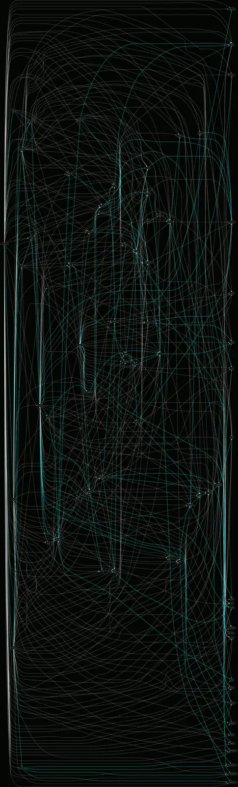
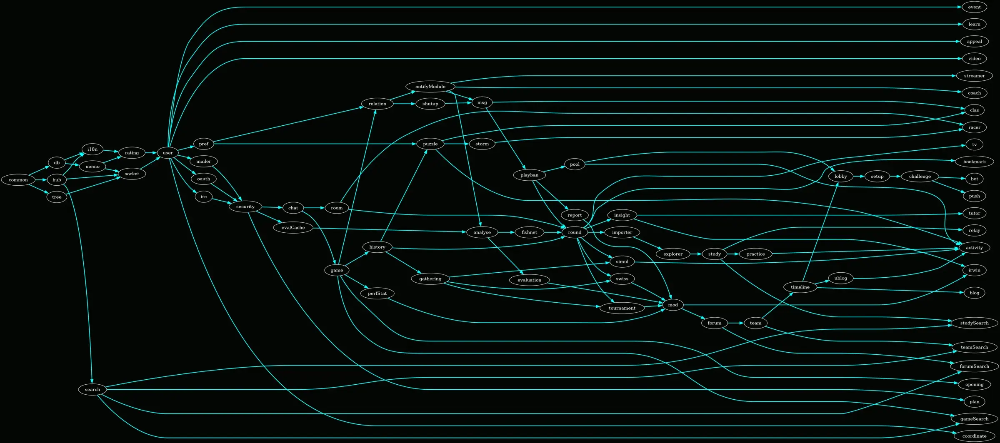

I recently started contributing to development of Lichess ([lila](https://github.com/lichess-org/lila) is the main repo).
Architecturally it is a monolith written in Scala consisting of several dozens interconnected modules.
All the dependencies are conveniently specified in the `build.sbt` file, which looked something like this:

```scala
lazy val puzzle = module("puzzle",
  Seq(common, memo, hub, history, db, user, rating, pref, tree, game),
  ...
)

lazy val user = module("user",
  Seq(common, memo, db, hub, rating, socket),
  ...
)
```

As one can guess, the dependencies of each module are specified in a list given as an argument to the `module` function.
However, for many modules this list contains some transitive dependencies explicitly, while others are not included.
For example, the `puzzle` module can pull its `common`, `memo` , `hub`, and `rating` dependencies transitively through `user`, similar to how it does that with the `socket` dependency.

This situation is problematic because of at least 2 reasons:

- For a developer it is hard to understand the architecture from the first glance.
  Which modules support which others?
- It is hard to say whether adding a new dependency would lead to a dependency cycle (without running the build tool).

### Untangling the mess

After some googling (chatGPT-ing?) I could not easily find a satisfying dependency resolution/simplification tool and so decided to write (prompt?) a script that would do that for me.
ChatGPT suggested using python libraries [networkx](https://networkx.org/) for graph building/analysis and [pydot](https://github.com/pydot/pydot) for the generation of pretty images.

The script itself can be found [here](https://github.com/lichess-org/lila/blob/c0ea98d0cd5ce61a8aaf0cf50f42455e16463415/bin/dependency-graph.py) and in essence consists of the following steps:

- Parse `build.sbt` and build the directed graph.
  The resulting graph should be acyclic (no dependency cycles) and therefore allow the specialized graph operations used in the following steps.
- Split the graph nodes into "topological generations": node collection in which ancestors of a node in each generation live in a previous generation, and any descendants of a node are in a following generation.
  Having this information allows us to group the nodes by generations and create a "human-readable" graph with dependencies flowing in one direction.
  However, there are still too many of them.
  The next step is to throw away all unnecessary explicit dependencies (edges).
- Build "transitive closure" of the dependency graph: this basically adds all transitive dependencies to the graph.
  Now we just need to build the minimal graph that has the same transitive closure as this one.
- Filter out all non-essential edges (dependencies).
  An essential dependency is the one which must always stay explicit, i.e., it cannot be pulled transitively from any other dependency of a given node.
  If I am not mistaken, it can be proven that in an acyclic graph for each node keeping only essential edges produces the same transitive closure.

That's it, now the only thing left is produce pretty graphs using pydot.
Here are the old and the new (simplified) dependency graphs with essential dependencies colored in cyan and topological generations organized in vertical columns going from left to right:

**Original dependency graph:**



**Simplified dependency graph:**



### Conclusions

- The architecture of the repo is now human-readable. For example, the `gameSearch` module quite naturally depends explicitly only on `game` and `search`.
- Contributing to Lichess (and OSS in general) can be quite satisfying =)
- The same procedure can in principle be repeated for any project (in any language) with complicated dependency structure (architecture).
  It can also be extended easily to enable further analysis.
- Pydot has no user documentation 😱 while still being reasonably popular.
  Proceed on your own risk and only with the help of AI assistant. This, however, leads to its own problems.
- ChatGPT was eager to invent non-existent api functions or shuffle their arguments, so that I had to resort to googling human-written code many times.
  I blame missing documentation and relative obscurity of the subject for that.
  Nevertheless, even when the suggested code was wrong, it was still helpful in translating my stupid questions into more accurate graph-theoretical language.
