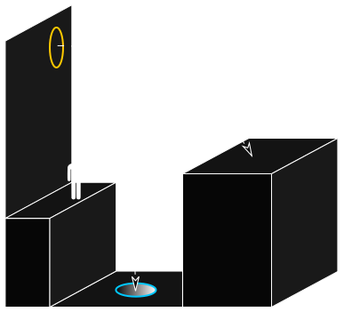
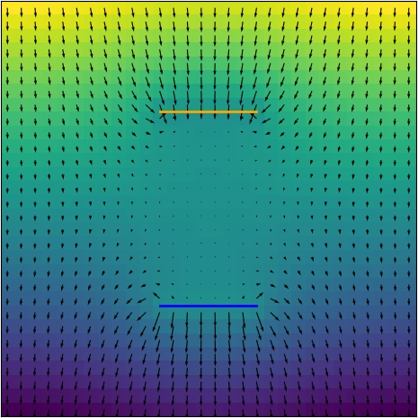
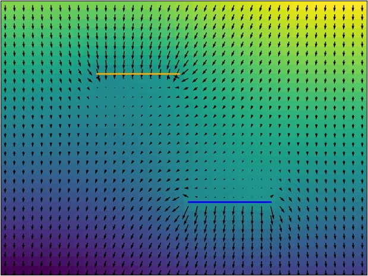
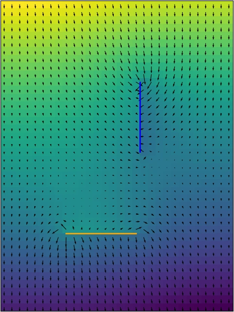

If you touched a computer game in this century you most probably heard of Portal (if not I strongly advise you to try it out).

In short, you are faced with a series of rooms, where you need to get from the entrance to the exit using normal rules of physics and a gun-like device that creates 2 connected human-sized portals on any surface.
This picture from the [Wikipedia](<https://en.wikipedia.org/wiki/Portal_(series)#Gameplay>) illustrates one of the techniques in the game:

And while it is undoubtedly a brilliant puzzle, something seems to be off with how physics works in the world of Portal.
Have you already noticed the problem? =)
Even with a PhD in Theoretical Physics, it dawned at me only recently that surely this cannot be right.

### "Physics" of portals

To the best of my knowledge, portals themselves are luckily not forbidden by the laws of physics.
It is just so happened, that the observable Universe around us expanded smoothly into (locally) Euclidian space after the Big Bang and we do not have any tears, cuts, or topological defects in space (except for the black holes, of course).
Actually, we know only very little about the true nature of space and time - not much more than:

1. They exist and there are 3 dimensions of space and 1 of time
2. Nothing can travel faster than the speed of light (as postulated in the [special theory of relativity](https://en.wikipedia.org/wiki/Special_relativity))
3. Mass (or energy in general) bends the space and time around it ([general theory of relativity](https://en.wikipedia.org/wiki/General_relativity))

But I digress. Let us suppose from now on that the portals are just a rewiring of space without any general-relativistic bends of space, that is to say, they make some parts of space "neighbours" that we wouldn't normally consider so.

### A bit of theory

The problem with the process in the image is that you end up higher than you started, which violates the conservation of energy.
The resolution of this paradox is simple - in the presence of portals the gravitational field can no longer be uniformly pointing down in general case.
Indeed, if you have a portal above your head then you should feel the gravitational pull of the Earth through it same as from the Earth beneath you.
But is there a way to prove it?

Of course, the Newton's law of universal gravitation $F = G\frac{mM}{r^2}$ does not apply anymore.
In fact, it is only valid in a 3-dimensional Euclidean space.
For example, in n dimensions the force drops as $(n-1)$-th power of distance and in 1 dimension it does not diminish at all.
In our weird space one needs to use the differential version of the [gravitational field equation](https://en.wikipedia.org/wiki/Poisson%27s_equation#Newtonian_gravity) $\nabla\cdot\vec{F} = −4\pi G \rho$ where $\rho$ is the mass density.
Same equation can be written for the gravitational potential and is usually easier to solve $\nabla^2\phi = 4\pi G\rho$ and $\vec{F} = −\nabla \phi$.
Indeed, on the Earth surface the mass density is negligible (compared to the mass of the Earth) and the potential simply becomes a linear function, which in its turn gives a constant gravitational field.
Unfortunately, none of my differential equation courses really covered spaces with defects and so I couldn't come up with an analytical solution to even the simplest portal configurations like, for example, two point-like portals near the Earth surface or even a single one leading far away into space with no gravity.
Maybe you have an idea how to solve it?

### Numerical approach

Anyway, as a software developer one should be able to make computer solve any problem.
Luckily, our problem is simply a Laplace equation with some unusual boundary conditions and so should be easily solvable numerically in its [discrete form](https://en.wikipedia.org/wiki/Discrete_Poisson_equation).
For simplicity I chose a simple rectangular 2D grid as our space.
In the discretized case the Laplace operator takes a simple form:

$$
\nabla^2\phi(x,y) = \left(\frac{\partial^2}{\partial x^2}+\frac{\partial^2}{\partial y^2}\right)\phi(x,y)
\quad\Rightarrow\quad
\phi_{i+1,j}+\phi_{i−1,j}+\phi_{i,j+1}+\phi_{i,j−1}−4\phi_{i,j}
$$

On the edges of the grid I used a so-called [Neumann boundary condition](https://en.wikipedia.org/wiki/Neumann_boundary_condition): on left and right sides of the grid the horizontal gradient is zero, whereas on top and bottom sides the vertical gradient is constant.
In other words, far away from the portals the gravitational field should return to its usual constant form.
In order to simulate portals I placed them in-between the cells and rewired the method that calculates neighbors of a cell, i.e., cells near the portal have their corresponding neighbor on the other side through the portal (the portals work from both sides each surface leading to the corresponding one on the other portal).
To find the solution I used a simple [relaxation scheme](<https://en.wikipedia.org/wiki/Relaxation_(iterative_method)>) that updates the values of the potential each step proportional to the value of the Laplacian.
The code for all of this can be found [here](https://github.com/drybalka/portal/tree/main).

### Results

I did a few simulations with different portal configurations and the results are presented below.
The inner faces of portals are interconnected and so are the outer faces.
The color denotes the value of the gravitational potential (brighter is higher) and arrows denote the direction and the magnitude of the resulting gravitational force.

#### Portals aligned above each other

In the case of portals being one above the other there is almost no force in space between them.
There is even a slight pull up near the bottom portal as the gravity tries to push you away from coming through.
In a way the bottom portal shields the space above from gravity - it is harder to see the Earth from there than from anywhere else.
And naturally if you jump trough one of them you will float in weightlessness as opposed to accelerating indefinitely.

#### Portals shifted above each other

A similar situation arises when the portals are shifted horizontally.
Even though there is a downward pull almost everywhere now, one will have to work against gravity trying to move horizontally from one portal to the other.

#### Portals orthogonal to each other

Finally, we consider the situation as shown in the picture above.
As one can see there is almost no force pulling you on the way to the bottom portal and so the jump illustrated above is unfortunately impossible.

Thank you for reading and check out the game if you haven't yet, after all the laws of physics should never stand in the way of fun =)
